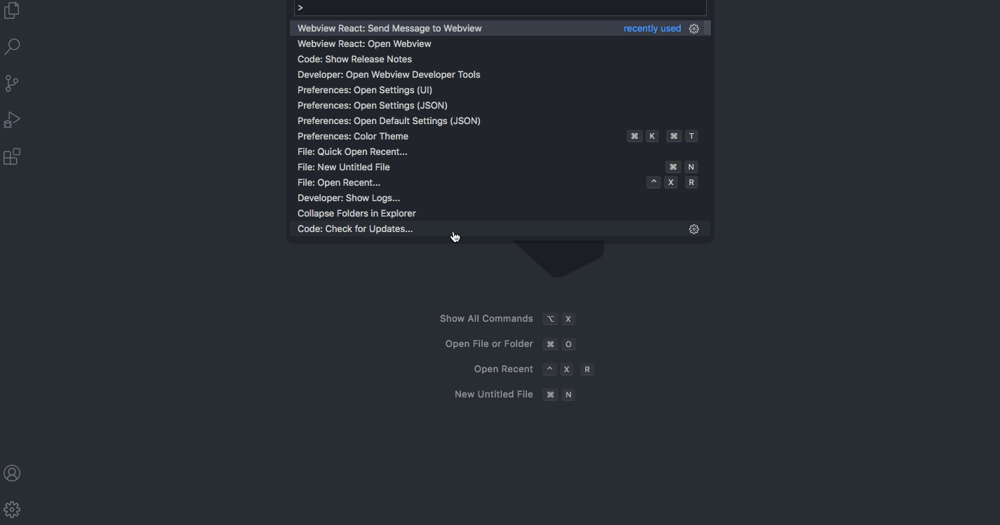

# VSCode Webview React Boilerplate

An awesome boilerplate for developing VSCode Extension Webview in `React`, `React Router` and `TypeScript`.



Project was inspired by:
- [Reactception : extending a VS Code extension with Webviews and React](https://medium.com/younited-tech-blog/reactception-extending-vs-code-extension-with-webviews-and-react-12be2a5898fd)
- [vscode-webview-react](https://github.com/rebornix/vscode-webview-react)
- [VSCode Webview API](https://code.visualstudio.com/api/extension-guides/webview)

## Development

Install dependencies first.

```bash
$ npm install
```

After the install process you can press `F5` to "Start Debugging" (or: select in menu **"Debug" -> "Run Extension"**). A new Extension Development Host window will open in which you need to open command palette (`Ctrl/Cmd + Shift + P`) and select **"Webview React: Open Webview"** to open webview.

Functionalities covered:
- Router
- Communication between Webview and Extension
- Integrated configuration
- Mock API Request